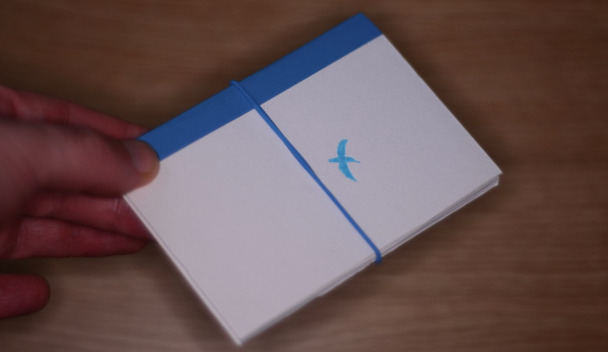

--- 

title: "Designing Pocket Productivity: There Doesn't have to be an App for That"
categories: ["Projects"]
tags: ["Design"]

---

A while back I worked on an Agile development team, where we planned the work of our weekly sprint on a Kanban board. The board contained three columns: 'to do', 'in progress', and 'done', starting out with a bunch of tasks on post-it notes in the 'to do' column. Team members do tasks one-by-one, until they're all moved to the 'done' column by the end of the week. In addition to managing daily tasks in this way, I really liked the weekly planning and review that happened before and after the week of work, as well as the notion of limiting work in progress to one task before moving on to the next one.

Kanban boards are for teams. But I've often wondered, is there a way to have such a planning system in my pocket? Of course, the standard response to that question - and my own response for quite some time - was "There's an app for that!" [^1] But over time our smartphones have become a far more intense battleground for our attention. Install whatever task planning app you like, and Facebook and countless others will still be right next to it trying to pry your eyes and your time away from your greatest ambitions. 

I wanted a pocket planner made from paper. And as it turns out, paper stacks up really, really well against any smartphone app:

<table class="table table-striped table-bordered">
<thead>
<tr>
<th style="text-align:right"></th>
<th style="text-align:left">Smartphone</th>
<th style="text-align:left">A Paper Planner</th>
</tr>
</thead>
<tbody>
<tr>
<td style="text-align:right">Battery life</td>
<td style="text-align:left">8 hours or so</td>
<td style="text-align:left">Friggin’ infinite yo</td>
</tr>
<tr>
<td style="text-align:right">Distracting notifications</td>
<td style="text-align:left">Wicked lots</td>
<td style="text-align:left">0</td>
</tr>
<tr>
<td style="text-align:right">Protective cover</td>
<td style="text-align:left">Sold separately</td>
<td style="text-align:left">Preinstalled; Free!</td>
</tr>
<tr>
<td style="text-align:right">Thin, flexible display</td>
<td style="text-align:left">No</td>
<td style="text-align:left">Yes</td>
</tr>
<tr>
<td style="text-align:right">Cumbersome lock screen</td>
<td style="text-align:left">Yes</td>
<td style="text-align:left">No</td>
</tr>
<tr>
<td style="text-align:right">Mac/Win/Linux Compatible</td>
<td style="text-align:left">Prolly not</td>
<td style="text-align:left">Yes</td>
</tr>
</tbody>
</table>

Although there are lots of paper planners on the market out there, I couldn't really find a pocket-sized planner that fit my needs. And while there are lots of blank pocket notebooks on the market, most of them are... well... blank [^2]. So I set about designing my own pocket-size paper planner, with a three-state kanban board in mind as my initial inspiration. I don't consider myself a designer, although I like to think I can design a little bit [^3].

Below I've tried to document the process, partly for my own records, but also to illustrate the main principle behind the planner: *Small, consistent baby steps, guided by a long term goal, are incredibly powerful.* 

### Iteration 0: What would a kanban to-do list look like? (Hint: Ridiculous)

I started out by making a sort of three-state to-do list: 

This proved to be completely silly as you can see, but it was a worthwhile exercise in that it showed me that three states weren't necessary at all  [^4]. 

**Decision**: Obviously if an item on the list at all then the first "to do" state is implied, which meant I only needed two check boxes for "in progress" and "done", as you can see in a subsequent iteration which I made soon after:

### Iteration 1: Three-state Daily To-Do List, 12 Tasks/Day

I started out by simply printing small pieces of paper with my designed to-do list on it. Then I got the bright idea to bind a small book by hand, following a [wonderful little tutorial](https://www.youtube.com/watch?v=9O4kFTOEh6k) by Youtube user Sea Lemon, containing enough pages for about a year. 

**Conclusions after testing:**

* I found I was putting evening tasks on the bottom (e.g. "remember the milk"), to remind me that they were to come later in the day. Maybe I could separate daytime and evening tasks?

### Iteration 2: Designate bottom tasks for 'evening'

I got a little playful with this one, but the significant update here was formally assigning a lower grey section for evening tasks. 

Without thinking too much about it, I also added more tasks per page.  

**Conclusions after testing:** 

* I really don't need so many tasks per page. A gave a copy to a friend, and he told me the same thing. **Decision**: Reduce them!
* At this point, I wasn't sure if I'd ever sell this thing, but I knew binding it by hand wasn't really scalable. (I had so much fun binding it though!) Hand binding is out. 

 **Other ideas**: Should I make a logo or brand for this thing?

### Iteration 3: Reduced Three-State, 6 Day Tasks / 3 Evening Tasks

I felt really good about this design, and the sun and moon icons had me feeling pretty clever about myself. But perhaps the main improvement here is that I really pushed to reduce the amount of tasks per page. 

You'll notice I also rolled out a snazzy blue bird logo, which is actually just a photograph of a kingfisher I took (my [other hobby](../static/projects/kingfishers/index.html)) and just traced it: 

The blue color is literally color-picked from the bird's body. I also tried using a Japanese print-on-demand service, seichoku.com, to create an A6-size, perfect-bound prototype of this version. On a whim, I also printed up a tiny A7-size version (half as big as above) on my home printer to see how compact I could make this simplifed design.  (I suppose this is iteration 3B, technically...)

**Conclusions after testing:** 

* After a few months of testing this design, I found I was frequently forgetting to check "in progress" when starting a task, and checking both boxes later when I had completed the task. **Decision**: Turns out I don't need even two check boxes. One is enough. (The good old single-box to-do list proves useful after all)
* Perfect bound is a bad idea, because it doesn't lay flat on my desk. Saddle stitch is better.
* The A7 version is super small, but yet the daily list isn't as cramped as I thought it might be.

**BIG IDEA:** How many of these A7 days could I fit on an A5-size spread? Could I fit a week, I wonder? Could I squeeze a week on a pocket-size A5 spread?

### Iteration 4: Weekly Spread, 6 Numbered Tasks/Day, with Weekly Goals

This felt like progress. I had six numbered tasks per day, mercilessly cutting out the day and evening idea that I liked so much before in an effort to fit all seven days on a spread. Six numbered tasks per day is neat, because that's pretty much the Ivy Lee Method, which recommends prioritizing or limiting yourself to the six most important things you need to get done in a day. Sometimes less really is more. 

**Conclusions after testing**:

* I'm not using Saturday and Sunday sections very much, since I don't work on those days. And I suspect maybe most people are like that. Though maybe not. Hmm...
* That horizontal line across the middle stands out way too much.

### Iteration 5: Weekly Spread, 6 Numbered Tasks/Day, with Weekly Goals

Since I hadn't really used my planner as much on weekends, I combined Saturday and Sunday into one "day".  So 5 weekdays + Sat/Sun + Planning + Review = 8 sections. That isn't awful, though for anyone who works weekends, I might have to sort out some sort of "flex" label later. For now, I decided to make what works for me.

I also lightened that middle line that I didn't like in the previous version. Do I even need it at all?

I returned to saddle-stich instead of perfecting binding, because it was just easier to lay flat. But in order to do this, I had to do some math to keep within their 48-page limit, because any more pages than that and they can't staple it. For 48 pages, I settled on 20 weekly spreads (40 pages) plus the cover (4 pages; front and back both sides). That's 44 pages, with 4 pages left. I decided that I could split the notebook into two 10-week halves, because it was sort of easier to wrap my head around 10-week goals. Add on a planning and review page for each 10-week half and I have 48 pages in total. Awesome. 

I had seichoku print a few copies of that which I handed out to some friends for testing as well:

**Conclusions after testing:** 

* My task lines are not long enough to write on. I just don't have enough horizontal space and I'm writing in the margins a whole lot. That sucks. 

**Other ideas**: I'm using a weekly spread and my tentative logo is a bird. Maybe I can do a clever "spread your week/wings" punny cover?

### Iteration 6: Weekly Spread, two lines per task

By combining the checkbox and the list numbers, I could save some horizonal space. I also decided to make better use of the margins by printing right to the edge. This let me go from one line per task to two, which solved my problem of not having enough space to write.  I also added some 'or flex' text to the Sat/Sun and 'Review' sections, for anyone who might want to work full days on weekend, though I think this still lacks clarity. 

I also asked a designer friend to try a "spread your week" cover, which I thought was neat. When you lay the book flat, the bird spreads it wings. Yay! 

**Conclusions after testing:**

* The "Spread your week" idea for the cover was a bad one. And I probably should have resisted the urge to be clever here. When it comes to logos and branding, if it isn't something you'd wear proudly on a t-shirt, then you should probably ditch it. **Decision:** Ditch this cover design. Maybe go back to simpler bird logo.  

### Iteration 7: Same Weekly Spread, Simple Logo Cover

I was more or less happy with this design, and I decided to do a small print run of 1000 units via a printing company in China. I initially reached out to a company here in Japan to do it, but when I received no response (email) I decided to give the task to the company with the better customer service. I also created a modest home on the web for the project [here](/kawasemi.html).

**Conclusions after testing:**

* I can probably further refine the inside design, as well as the instructions page. 
* The printer I went with did a decent job with the printing, but I found the stapling was had been done manually and was inconsistent at times. Thus, I had to examine all my planners and reject any where the staple was a little off-center. That turned out to be about 40 books, which wasn't too bad -- though disappointing all the same. 

### Ok, now what?

This is where I am now. So far, the process process of bringing a product into being has been far more educational that I ever could have expected, especially for a weekend side project. If you have any questions about anything above, don't hesitate to get in touch with me. 

**Future ideas:**

* Are any wholesalers interested in this? (If this is you, get in touch!)
* Would any companies want a branded/white label version? (Contact)

[^1]: Trello might be my favorite, especially if you need to involve other collaborators.

[^2]: Yes, I considered Bullet Journal, but to be frank I sort of zoned out during that long "how to" video. It obviously works for a lot of people, but regrettably, I'm not one of those people. 

[^3]: Over time, I've found that it's far easier (and indeed, far more accurate) to describe myself to people using verbs instead of using nouns. 

[^4]: The Japanese date input in the top right is just something that I kind like as a perpetual student of the language and as a resident here in Japan.

