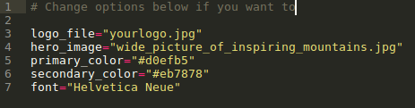
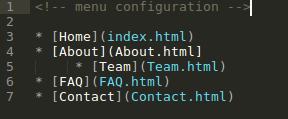

---

title: Simple Static Sites for the Rest of Us
categories: ["Projects"]
tags: ["Web Development", "Small Web"]

---

Every now and then, I (or someone I know) have a need to create a very simple website. Now, regrettably the de facto website builder for the world has for a long time been Wordpress. And that's fine if you need a blog. 

But what if you just need a simple website with just a few pages? Typical examples of this are:

* A portfolio site with a "Work Samples" page, and maybe a page to contact you
* A small business website, which has a "Services" page to tell what you do, and a "team" page about you and your staff. (Examples: a mom-n-pop restaurant, or a bed-and-breakfast, or a yoga studio)
* A product page, like for my [Bluebird Pocket Planner notebook](/kawasemi.html), which I recently launched [^1].

**If you are a web developer**: No problem! You benefit from a recent renaissance in static site generators, and can build a site in a jiff using any number of site builders like Jekyll, Hugo, Middleman, or literally hundreds of others. You then can serve your static HTML website from Amazon S3, Github Pages, Netlify, or some paid hosting service, and set up a snazzy .com domain name too. 

**Not a web developer?** Sucks to be you. The vast majority of the static site generator tools out there are run from the command line, powered by things you've never heard of like Node, Grunt, or Babel. So you reluctantly turn to Wordpress, Wix, or Squarespace where, if you decide you want your own custom .com domain name, you find out you have to pay a monthly subscription of at least $4, $5 or $12 respectively. 

The static site renaissance has left you behind, dear <strike>sucka</strike> reader, the new hotness speeding off in the distance while you settle for what was hot in 2005. Dust off your Nickelback CDs, you'll need a soundtrack. 

### So What Would a Static Site Generator for the Rest of Us Like Like?

I'm glad you asked. I think it'd be a desktop app. Static site generators (or at least the ones I really like) typically build sites from a collection (or folder) of Markdown files. For example:

* index.md
* about.md
* contact.md
* faq.md

Since phones aren't the best for manipulating files and folders, I think a Mac/Windows/Linux app would be best to handle this. Depending on the type of site you want to make (a portfolio, a small business website, etc) you'll probably want to choose from a range of templates:

* Personal_Site
* Portfolio
* Photo_Site
* Restaurant
* BnB
* Yoga_Studio
* Etc, etc...

After selecting your template, your folder of Markdown files is pre-populated, and you can replace the dummy content with your own. And in my perfect world, you also might see a config.txt file where the theme you just chose is declared (e.g. `template="Restaurant"`. This file might also be a good place to declare or override other things like:

This configuration file would also be a great place to declare what you want your navigational menu structure to be. I like nested lists of links (where nested items become dropdown menus):

At this point in our hypothetical web building process, you might press the "build site" button, and all your markdown files are converted to a nice little collection of HTML files that you can then host from wherever you want. And for non-technical users, our hypothetical desktop app should have either FTP support (and documentation), or guidance to host to places like S3 or other commonly used hosting services. 

### Icing on the Cake

Other features that I'd include that I personally think would be nice to have.

* [Multimarkdown](http://fletcherpenney.net/multimarkdown/) for [tables](http://fletcher.github.io/MultiMarkdown-5/tables.html) and [Footnotes](http://fletcher.github.io/MultiMarkdown-5/footnotes.html) (and [Bigfoot.js](http://www.bigfootjs.com/) for those sexy mouse-hover footnotes).
* Table of Contents shortcode, sort of [like Marked app](http://marked2app.com/help/Interface_Features.html#customizingthetableofcontents) and [this fork of Strapdown.js](http://ndossougbe.github.io/strapdown/#features) have.

### Site Generators Worthy of Mention

It's possible that there might already be a wonderful static site generator out that is accessible to non-technical users. If you know of one, let me know. But there are a few site generators that I do like, and I'll mention them here:

* [Poole](https://bitbucket.org/obensonne/poole): A python-based site generator that does much of what I've described above, and influenced a lot of my ideas here. Unfortunately, it is a command line tool which disqualifies it as being a site generator for non-technical users, I feel.
* [MKdocs](https://www.mkdocs.org/): Similar to Poole, but this generator is aimed at making documentation pages. 
* Cactus: No longer maintained (to my knowledge), this Mac OSX app was created by a team that includes Koen Bok, the creator of Framer. It [generated a little bit of buzz](https://thenextweb.com/apps/2014/02/08/sofas-former-co-founder-art-director-relaunch-static-site-generator-cactus-mac/). It can still be downloaded from some online repositories [like this one](https://www.macupdate.com/app/mac/50357/cactus), though. 

[^1]: For my Bluebird Pocket Planner website, I used Poole, which I mentioned in the last section of this page. For the site you are reading right now, I use [Pelican](https://blog.getpelican.com/). 

 